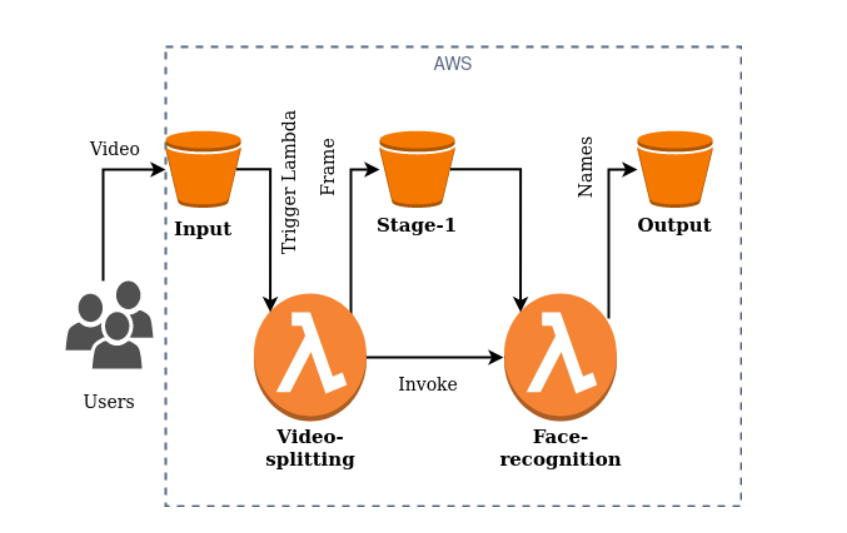

# Elastic Video Analysis Application using AWS Lambda

This project develops an elastic video analysis application that automatically scales on-demand using AWS Lambda and other supporting AWS services. The application processes videos through a multi-stage pipeline, leveraging serverless computing to provide a cost-effective and scalable solution.

## Table of Contents
- [Project Overview](#project-overview)
- [Architecture](#architecture)
- [Components](#components)
  - [Input Bucket](#input-bucket)
  - [Stage-1 Bucket](#stage-1-bucket)
  - [Output Bucket](#output-bucket)
  - [Video-splitting Function](#video-splitting-function)
  - [Face-recognition Function](#face-recognition-function)
- [Setup and Deployment](#setup-and-deployment)
- [Testing](#testing)
- [License](#license)

## Project Overview
The project builds an AWS Lambda-based video analysis application. The application receives videos, splits them into frames, detects faces using machine learning, and outputs the recognized names. It is designed to be highly elastic and cost-effective, leveraging the power of AWS PaaS services.

## Architecture
The application consists of multiple stages implemented as AWS Lambda functions, supported by AWS S3 for data storage. Each video is processed through a series of functions that handle video splitting and face recognition.

## Components

### Input Bucket
- **Description**: Stores the videos uploaded by users.
- **Naming Convention**: Must be named `<ASU ID>-input`.
- **Trigger**: Uploading a video triggers the `video-splitting` Lambda function.

### Stage-1 Bucket
- **Description**: Stores the output of the video-splitting function, specifically images of video frames.
- **Naming Convention**: Must be named `<ASU ID>-stage-1`.

### Output Bucket
- **Description**: Stores the results of the face-recognition function, specifically text files containing recognized names.
- **Naming Convention**: Must be named `<ASU ID>-output`.

### Video-splitting Function
- **Name**: `video-splitting`
- **Trigger**: Triggered by new video uploads in the Input Bucket.
- **Functionality**: Splits the video into frames using FFmpeg and stores one frame per video in the Stage-1 Bucket. Invokes the `face-recognition` function asynchronously.

### Face-recognition Function
- **Name**: `face-recognition`
- **Trigger**: Triggered by the completion of the `video-splitting` function.
- **Functionality**: Detects faces in images, compares them using a pre-trained ResNet-34 model, and stores the recognized name in a text file in the Output Bucket.

## Setup and Deployment
1. **Deploy Lambda Functions**:
   - Use the provided code templates for `video-splitting` and `face-recognition`.
   - Ensure that the necessary libraries (e.g., FFmpeg, OpenCV, PyTorch) are installed and configured correctly in your Lambda environment.

2. **Create S3 Buckets**:
   - Create the Input, Stage-1, and Output Buckets using the naming conventions provided.

3. **Configure IAM Permissions**:
   - Set up an IAM user with the necessary permissions (`s3:Get*`, `s3:PutObject`, `s3:List*`, etc.) to facilitate the grading process.

## Testing
- Use the provided workload generator to thoroughly test the application with various videos.
- Ensure the functions are triggered correctly, and the outputs are stored in the appropriate buckets.

## License
This project is part of the Cloud Computing course (CSE 546) and follows the guidelines and submission policies set by the instructor.
